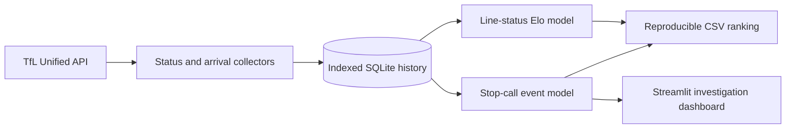

<picture>
  <source media="(prefers-color-scheme: dark)" srcset="assets/banner-dark.svg">
  <source media="(prefers-color-scheme: light)" srcset="assets/banner-light.svg">
  
</picture>

# TfL reliability

Which Tube line is actually running best? This project polls Transport for London's live
status and arrival feeds, preserves the observations in SQLite, and converts them into
Elo-style reliability rankings.

The difficult part is temporal: successive predictions must be reconciled into arrivals,
late trains, and cancellations without scoring the same disruption on every poll. The
repository includes both a lightweight line-status model and a stop-call event model,
plus a Streamlit dashboard for inspecting the signal.

## Current readout

This is a real run of `tfl_line_elo.py`, captured at **14:50 UTC on 30 July 2026** from two
credential-free TfL API polls. The CSV is committed as
[`tfl_line_elo_leaderboard.csv`](tfl_line_elo_leaderboard.csv).

| Position | Line | Elo | Good service | Latest status |
|---:|---|---:|---:|---|
| =1 | Bakerloo | 1523.88 | 100% | Good Service |
| =1 | Central | 1523.88 | 100% | Good Service |
| =1 | Circle | 1523.88 | 100% | Good Service |
| =1 | Hammersmith & City | 1523.88 | 100% | Good Service |
| =1 | Jubilee | 1523.88 | 100% | Good Service |
| =1 | Metropolitan | 1523.88 | 100% | Good Service |
| =1 | Northern | 1523.88 | 100% | Good Service |
| =1 | Victoria | 1523.88 | 100% | Good Service |
| =1 | Waterloo & City | 1523.88 | 100% | Good Service |
| 10 | Piccadilly | 1498.82 | 0% | Part Closure |
| 11 | District | 1489.39 | 0% | Part Suspended |

Two polls prove the complete path and show the live network state; they do not constitute
a long-term punctuality study. Leave the collector running to build a meaningful local
history, then rerun the same ranking command.

## Signal path



The two scoring paths answer different questions:

| Path | Observation | Best for |
|---|---|---|
| `tfl_line_elo.py` | One status for each line per poll | A fast network-wide readout |
| `tfl_train_event_elo.py` | Predictions sampled at individual stops | Arrival, lateness, and cancellation evidence |

Line-status Elo uses TfL severity as the outcome, rewards sustained Good Service, and
penalises adverse transitions and cancellation mentions. The train-event model resolves
successive stop predictions, gives peak-hour failures more weight, and applies slower
movement near the score boundaries. Both models rebuild rankings from stored evidence.

## Run it

Python 3.9 or newer is required because the train-event path uses `zoneinfo`.

```powershell
git clone https://github.com/LolStar123/tfl-reliability.git
cd tfl-reliability
python -m venv .venv
.\.venv\Scripts\Activate.ps1
python -m pip install -r requirements.txt

# Capture two line-status snapshots, then rank the last 24 hours.
python tfl_line_elo.py collect --iterations 2 --interval 60
python tfl_line_elo.py rank --lookback-hours 24
```

The public TfL endpoints work without credentials. For higher API limits, set
`TFL_APP_ID` and `TFL_APP_KEY` in the environment; both CLIs also accept `--app-id` and
`--app-key` before the subcommand.

For the train-event view, keep the monitor running in one terminal:

```powershell
python tfl_train_event_elo.py monitor --max-stops-per-line 4 --interval 60 --iterations 0
```

Then open the dashboard from a second terminal:

```powershell
python -m streamlit run tfl_train_event_dashboard.py
```


The screenshot uses a three-cycle live sample from 19 rotating stops on 30 July 2026. It
demonstrates the interface and collector, not a claim about whole-network performance.

## Repository map

| File | Responsibility |
|---|---|
| `tfl_line_elo.py` | Line-status ingestion, SQLite schema, ranking CLI |
| `tfl_train_event_elo.py` | Stop sampling, event reconciliation, train-event scoring |
| `tfl_train_event_dashboard.py` | Live status overlay, tables, event feed, charts |
| `tfl_fare_data.py` | Separate 2025/26 fare and capping reference module |
| `*_leaderboard.csv` | Captured model outputs for inspection |

Generated `*.db` files stay local and are ignored by Git. To contribute, keep ingestion,
event resolution, and scoring changes separate where possible; run
`python -m compileall -q .` and exercise the relevant CLI before opening a pull request.

This project is available under the [MIT License](LICENSE). TfL data remains subject to
Transport for London's own terms.
