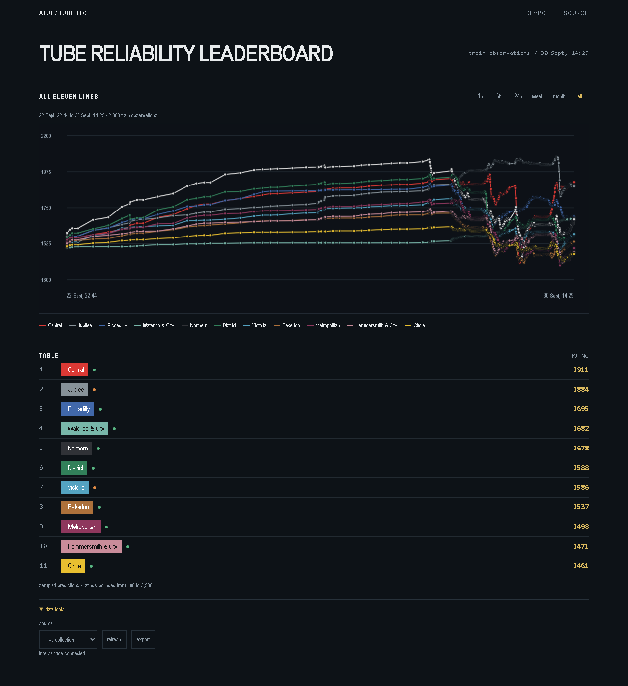

# Tube reliability

[Open the dashboard](https://lolstar123.github.io/tfl-reliability/) | [Scoring model](tfl_train_event_elo.py) | [Data provenance](PROVENANCE.md)

Compare all eleven London Underground lines using ratings built from repeated arrival predictions. The ranking and history chart share the first view; select a line to follow its history, or change the timeframe to see how its rating developed.



## Use the dashboard

- **Live collection** shows the latest collected event feed and a separate current-service status for each line. The observation timestamp tells you how recent the ratings are.
- Select a ranking row to focus its history. Select it again, or choose **Show all**, to restore all eleven lines. The legend can compare a subset.
- Choose **1h**, **6h**, **24h**, **Week**, **Month** or **All**. Open the five-minute candles or recent sampled events for more detail.
- Switch to **Original hackathon archive** to inspect 539 recovered rating observations from 28 March 2026. Archive ratings and counts never enter the live totals.
- **Refresh** reloads observations and service status. **Export CSV** downloads the displayed ranking and event counts.

## What the ratings mean

The collector samples each line's predictions three times, twenty seconds apart, on a ten-minute cycle. Two sightings with an ETA within thirty seconds produce an estimated arrival; a slip of more than sixty seconds produces a late estimate. These are sampled predictions, not confirmed movements or an official punctuality statistic. A disappearing prediction is not a cancellation.

Each accepted event applies the original reward/penalty function with peak weighting, cubic restoring pressure toward 1500 and hard bounds of **100 to 3500**. This is an event rating, rather than pairwise zero-sum Elo. New live collection does not infer cancellations; the historical archive retains its original inferred counts.

The browser reads the durable `observations` branch and checks it every five minutes while visible. If that feed is unavailable, it tries the bundled snapshot, whose original timestamp remains visible. A service API outage removes service labels rather than retaining stale status. If both event sources fail, the page offers refresh or the archive.

## Run locally

The public dashboard needs a modern browser and Python for the local file server. No API key or account is required.

```sh
python -m http.server 8000 --directory examples/portfolio
```

Open **http://localhost:8000**. The interface runs locally, but current observations and service status require internet access. Bundled observations and the archive remain available offline.

## Verify

Checked with Python 3.11, Node 24 and isolated Chrome. Model and collector checks use the standard library:

```sh
python -m unittest discover -s tools -p 'test_*.py'
node --test examples/portfolio/*.test.mjs
python -m pip install playwright
python tools/browser_audit.py
```

On Windows the browser audit uses installed Google Chrome. On Linux/macOS, first run `python -m playwright install chromium`. It exercises the actual controls, source switches, CSV, rating bounds and feed failures at 1280px and 390px. Screenshots and its check record are written to ignored `output/qa/`.

The original Streamlit dashboard reads `tfl_train_event_elo.db`. Its separate collector creates that database with a collection pass:

```sh
python -m pip install -r requirements.txt
python tfl_train_event_elo.py collect --iterations 1
python -m streamlit run tfl_train_event_dashboard.py
```

That legacy collector retains its original event heuristics; the public dashboard uses `tools/collect_events.py` instead.

## Code map

| Path | Responsibility |
| --- | --- |
| `examples/portfolio/app.mjs` | Ranking, source selection, charts, status and CSV |
| `examples/portfolio/live.mjs` | Observation replacement, timeframe selection and event reconstruction |
| `examples/portfolio/model.mjs` | Browser port of the status model, retained for comparison |
| `examples/portfolio/style.css` | Departure-board layout and responsive controls |
| `tools/collect_events.py` | Prediction reconciliation and bounded event updates |
| `tools/persist_observations.py` | Durable observation history |
| `tools/audit_public.py` | Freshness, line coverage, limits and score agreement |
| `.github/workflows/example-pages.yml` | Separate interface deployment and observation collection |

Built with Benjamin Toze at QuantiHack 2026 after the five-day qualifying trading competition. [Original team source](https://github.com/bento-boxing/Quantihack2026project/tree/tfl-live-elo) and [Devpost](https://devpost.com/software/tfl-elo-tracker) preserve the project history. The earlier `tfl-elo.uk` endpoint was unavailable during restoration.
